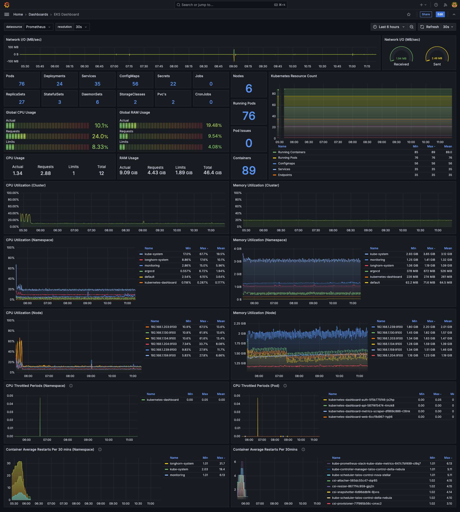
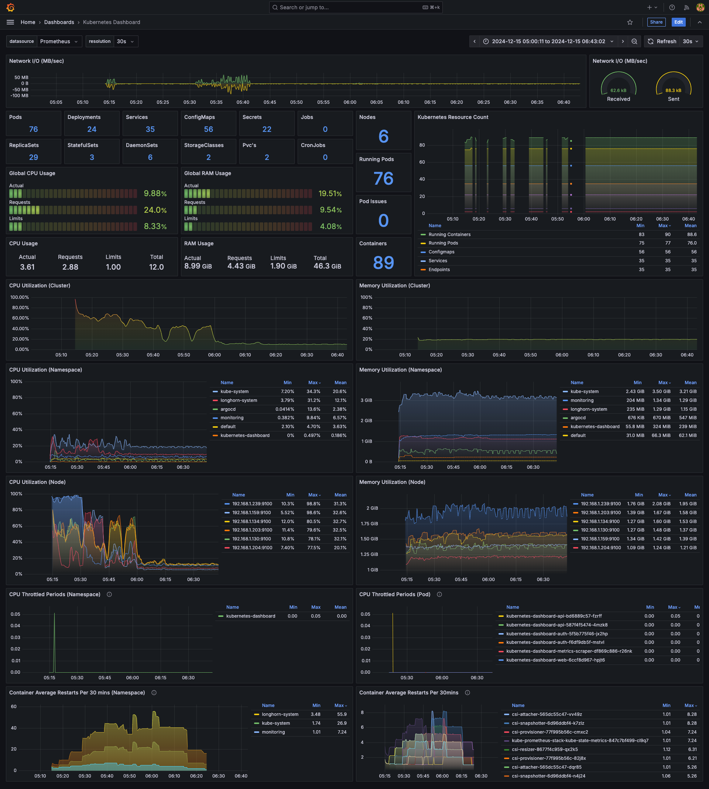

  
  

## Overview
High-level view of Kubernetes cluster - useful for monitoring, alerting and troubleshooting.

Works on local, bare-metal or cloud provided clusters (e.g. k3s, kind, minikube, Talos Linux, EKS etc..)

[https://grafana.com/grafana/dashboards/22523-kubernetes-dashboard/](https://grafana.com/grafana/dashboards/22523-eks-dashboard/)

<!-- https://github.com/adegoodyer/grafana-dashboards/kubernetes-dashboard -->

## Features
- network I/O
- k8s resource counts
- highlights pods not running
- CPU/RAM utilization (cluster, node, namespace and pod)
- CPU throttling information (namespace/pod)
- container restart information (namespace/pod)

## Dependencies
Last tested via `kube-prometheus-stack` Helm chart `v66.3.1`

However, will work when recent versions of the following Prometheus exporters are installed..
- `cAdvisor`
- `kube-state-metrics`
- `node-exporter`

## Contributing
1. Fork the repository
2. Create your feature branch (`git checkout -b feature/amazing-feature`)
3. Commit your changes (`git commit -m 'Add some amazing feature'`)
4. Push to the branch (`git push origin feature/amazing-feature`)
5. Open a Pull Request

## License
This project is licensed under the MIT License - see the [LICENSE](LICENSE) file for details.

## Support

<!-- https://www.buymeacoffee.com/adegoodyer -->