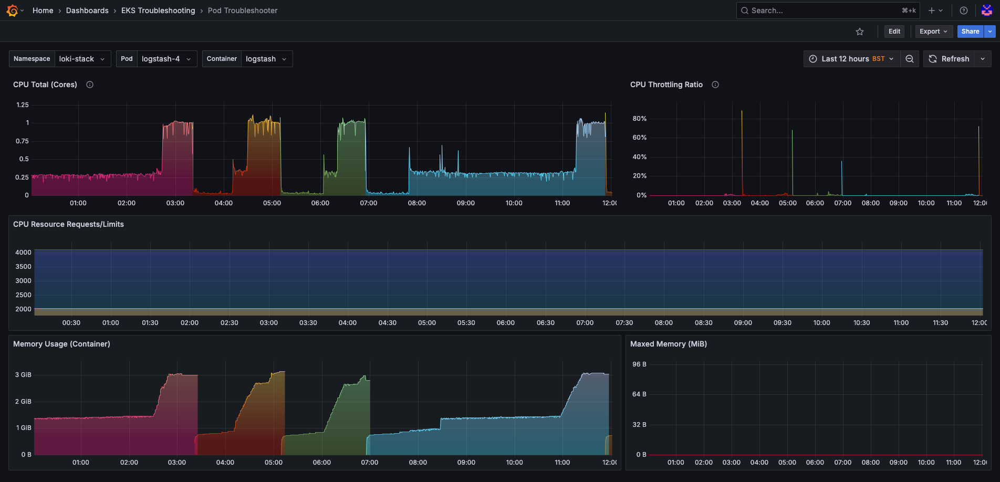

  

## Overview
- Troubleshoot pods via CPU and Memory resource usage.

Compatible with local, bare-metal or cloud provided clusters (e.g. k3s, kind, minikube, Talos Linux, EKS etc..)

## Features
- CPU Total
- CPU Throttled
- CPU Resource Requests/Limits

## Contributing
1. Fork the repository
2. Create your feature branch (`git checkout -b feature/amazing-feature`)
3. Commit your changes (`git commit -m 'Add some amazing feature'`)
4. Push to the branch (`git push origin feature/amazing-feature`)
5. Open a Pull Request

## License
This project is licensed under the MIT License - see the [LICENSE](https://github.com/adegoodyer/grafana-dashboards/blob/master/LICENSE) file for details.

## Support

<!-- [https://www.buymeacoffee.com/adegoodyer](https://www.buymeacoffee.com/adegoodyer) -->
